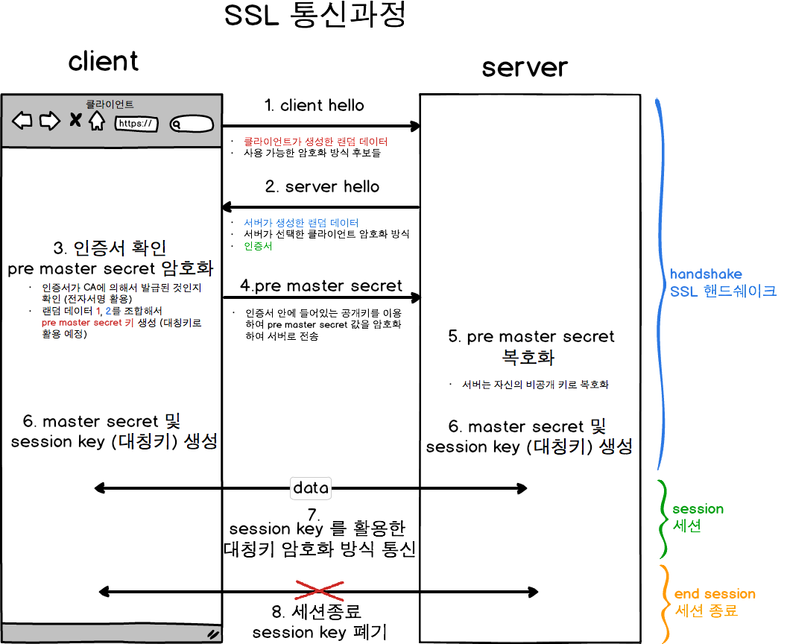

# http와 https의 차이

결론부터 말하자면 HTTPS는 HTTP에 데이터 암호화가 추가된 프로토콜이다.

## 1. http란?
---
HTTP(Hyper Text Transfer Protocol)란 서버/클라이언트 모델을 따라 데이터를 주고 받기 위한 프로토콜이다. 
즉 HTTP는 인터넷에서 [하이퍼텍스트](./잡것들.md#hypertext)를 교환하기 위한 통신 규약이다

### http의 구조
- HTTP 기본적으로 요청/응답 (request/response) 구조로 되어있다. 
    클라이언트가 HTTP request를 서버에 보내면 서버는 HTTP response를 보내는 구조. 
    클라이언트와 서버의 모든 통신이 요청과 응답으로 이루어 진다.

- HTTP는 Stateless 이다. 
    Stateless 란 말그대로 state(상태)를 저장하지 않는 다는 뜻. 
    즉, 요청이 오면 그에 응답을 할뿐, 여러 요청/응답 끼리 연결되어 있지 않다는 뜻이다. 
    즉 각각의 요청/응답은 독립적인 요청/응답 이다.

- HTTP는 Method, Path, Version, Headers, Body 등으로 구성된다.

### http의 동작 과정
> 서버 접속 -> 클라이언트 -> 요청 -> 서버 -> 응답 -> 클라이언트 -> 연결 종료

[http에 대한 더 자세한 내용](https://velog.io/@teddybearjung/HTTP-%EA%B5%AC%EC%A1%B0-%EB%B0%8F-%ED%95%B5%EC%8B%AC-%EC%9A%94%EC%86%8C)

## 2. HTTPS란?
---
HTTPS는 HTTP와 다르게 443번 포트를 사용하며, 네트워크 상에서 중간에 제3자가 정보를 볼 수 없도록 공개키 암호화를 지원하고 있다.

### 공개키/개인키

- 공개키: 모두에게 공개가능한 키
- 개인키: 나만 가지고 알고 있어야 하는 키

공개키 암호화에서 2가지 키를 사용하는데 그게 공개키와 개인키이다 
이 두 개의 키는 연관성을 가지고 있는데 
공개키로 암호화하면 개인키로 복호화가 가능하고, 개인키로 서명하면 공개키로 검증이 가능하다 
이러한 방법을 사용하는 사례가 우리나라의 공인인증서이다

공개키로 암호화를 하면 개인키로만 복호화할 수 있다. -> 개인키는 나만 가지고 있으므로, 나만 볼 수 있다는 장점이 있다 
이 방법은 안전하게 데이터를 주고받을 수 있게 만들어주지만 속도가 느리다는 단점이있다

### 동작 과정

1. [Handshaking](잡것들.md#Handshaking)
    1. Client Hello 
        클라가 서버에 접속하는데 이때 
        클라이언트 측에서 생성한 `랜덤 데이터` 
        클-서 암호화 방식 통일을 위해 `클라이언트가 사용할 수 있는 암호화 방식들` 
        이전에 이미 `Handshaking 기록이 있다면` 자원 절약을 위해 기존 세션을 재활용하기 위한 `세션 아이디` 
        등을 서버에 보낸다

    2. Server Hello 
        서버가 클라의 요청에 대한 응답을 보내는데 이때 
        서버 측에서 생성한 `랜덤 데이터` 
        서버가 선택한 클라이언트의 `암호화 방식` 
        [SSL 인증서](잡것들.md#SSL-인증서) 
        등을 클라에게 보냄

    3. Client 인증 확인 
        - 서버로부터 받은 `인증서가 CA에 의해 발급되었는지` 
            본인이 가지고 있는 목록에서 확인하고, 
            목록에 있다면 CA 공개키로 인증서 복호화
        - 클-서 각각의 랜덤 데이터를 조합하여 
            `pre master secret 값 생성`(데이터 송수신 시 대칭키 암호화에 사용할 키)
        - `pre master secret 값을` 공개키 방식으로 `서버에 전달`(공개키는 서버로부터 받은 인증서에 포함)
        - 일련의 과정을 거쳐 `session key 생성`

    4. Server 인증 확인 
        - 서버는 비공개키로 복호화하여 `pre master secret 값 취득`(대칭키 공유 완료)
        - 일련의 과정을 거쳐 `session key 생성`

    5. Handshaking 종료

2. 데이터 전송
    - 서버와 클라이언트는 session key를 활용해 데이터를 암복호화하여 데이터 송수신

3. 연결 종료 및 session key 폐기

이미지로 정리!!

## 참고 사이트

[https 동작 과정](https://velog.io/@averycode/%EB%84%A4%ED%8A%B8%EC%9B%8C%ED%81%AC-HTTP%EC%99%80-HTTPS-%EB%8F%99%EC%9E%91-%EA%B3%BC%EC%A0%95#%F0%9F%A7%9A%E2%99%80%EF%B8%8F-httpsssl%EC%9D%98-%EB%8F%99%EC%9E%91%EA%B3%BC%EC%A0%95)
[http와 https](https://mangkyu.tistory.com/98)