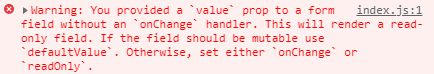

# You provided a `value` prop to a form field without an `onChange` handler. This will render a read-only field. If the field should be mutable use `defaultValue`. Otherwise, set either `onChange` or `readOnly`.




전 에러에 이어서 또 에러가 나왔다.

> You provided a `value` prop to a form field without an `onChange` handler. This will render a read-only field. If the field should be mutable use `defaultValue`. Otherwise, set either `onChange` or `readOnly`.

번역
> 'onChange' 핸들러 없이 양식 필드에 'value' 소품을 제공했습니다. 이것은 읽기 전용 필드를 렌더링합니다. 필드가 변경 가능해야 하는 경우 'defaultValue'를 사용합니다. 그렇지 않으면 'onChange' 또는 'readOnly'를 설정합니다.

번역기를 돌려보니 저렇게 나오는데 뭔 소린지 몰라서 그냥 구글링을 해 보았다.<br>
알고보니 내가 input태그의 value값에 onSubmit할 때만 값이 바뀌는 변수를 넣어줘서 그런 것이였다.

```js
// 변경전
<input placeholder="검색" value={input} />

// 변경후
<input placeholder="검색" />
```

항상 input 태그에서 변수를 받아올 때 onChange함수를 만들고 value에 값을 넣는 습관을 갖고 있다 보니 이런 실수를 저지른 것 같다.