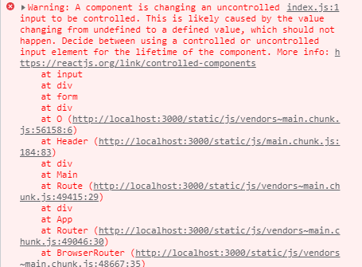
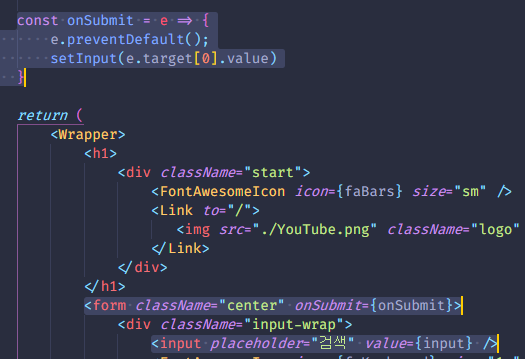

# A component is changing an uncontrolled input to be controlled. This is likely caused by the value changing from undefined to a defined value, which should not happen. Decide between using a controlled or uncontrolled input element for the lifetime of the component.



어느 날 useSate를 사용하다 발생한 에러인데 `input`태그에서 값을 받는데<br>
값이 바뀔 때(onChange)가 아닌 엔터를 입력할 때(onSubmit) 값을 받도록 만들었다.




하지만 아래와 같은 이상한 에러가 났다

> A component is changing an uncontrolled input to be controlled. This is likely caused by the value changing from undefined to a defined value, which should not happen. Decide between using a controlled or uncontrolled input element for the lifetime of the component.


번역
> 구성 요소가 제어되지 않는 입력을 제어하도록 변경하고 있습니다. 이는 값이 정의되지 않은 값에서 정의된 값으로 변경되기 때문에 발생할 수 있으며, 이는 발생해서는 안 됩니다. 구성 요소의 수명 동안 제어 또는 제어되지 않은 입력 요소를 사용할지 결정합니다.

그냥 보니깐 useState를 선언할 때 기본 값을 넣지 않아서 발생한 것 같다.<br>
그래서 useState선언을 아래와 같이 바꿨다.

```js
// 변경전
const [input, setInput] = useState();

//변경 후
const [input, setInput] = useState("");
```

하지만 에러가 바뀌었다...

[다음 에러를 해결하러 가기](./YouProvidedA.md)