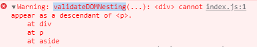

# Warning: validateDOMNesting(...): `
` cannot appear as a descendant of `
`.

이번 에러 내용은 아래와 같다

> Warning: validateDOMNesting(...): `
` cannot appear as a descendant of `
`.

번역
> 경고: validateDOMNesting(...): `
`는 `
`의 하위 항목으로 나타날 수 없습니다.

역시 뭔 소린지 알 수 없어서 구글링을 해 보니 생각보다 간단했다. 
`p`태그 아래에 `div`태그가 있으면 안 된다는 뜻이었다

react가 좀 엄격하다 보니 html 오류가 console에 뜬것 같다