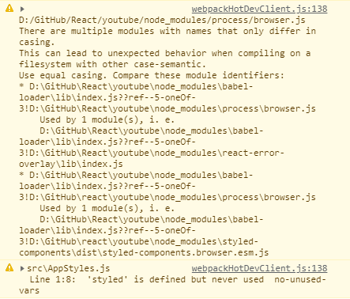

# There are multiple modules with names that only differ in casing.

> There are multiple modules with names that only differ in casing. 
> This can lead to unexpected behavior when compiling on a filesystem with other case-semantic. 
> Use equal casing. Compare these module identifiers

어느날 이런 에러가 떴는데 이게 styled-components라는 모듈을 import하면 생기는 에러였다. 

하지만 번역을 해보면 

> 대소문자만 다른 이름을 가진 여러 모듈이 있습니다. 
이것은 다른 대소문자 구분을 사용하여 파일 시스템에서 컴파일할 때 예기치 않은 동작으로 이어질 수 있습니다. 
동일한 케이싱을 사용하십시오. 이 모듈 식별자를 비교하십시오.

라고 해서 styled-components를 뜯어보기도 하고 삭제도 해봤지만 에러는 계속 살아있었다. 
사실 진짜는 아래 파일 경로를 알려주는 부분에 있었다.

> D:\GitHub\React\youtube\node_modules\babel-loader\lib\index.js??ref--5-oneOf-3!
D:\GitHub\react\youtube\node_modules\styled-components\dist\styled-components.browser.esm.js

여길 자세히 보면 위에 경로는 `D:\GitHub\React`라고 하는데 
아래에서는 `D:\GitHub\react\`라고 하면서 react에 대소문자가 바뀌어있었다. 
그래서 `React`라는 폴더 이름을 `react`로 바꿔주었더니 에러가 사라졌다.