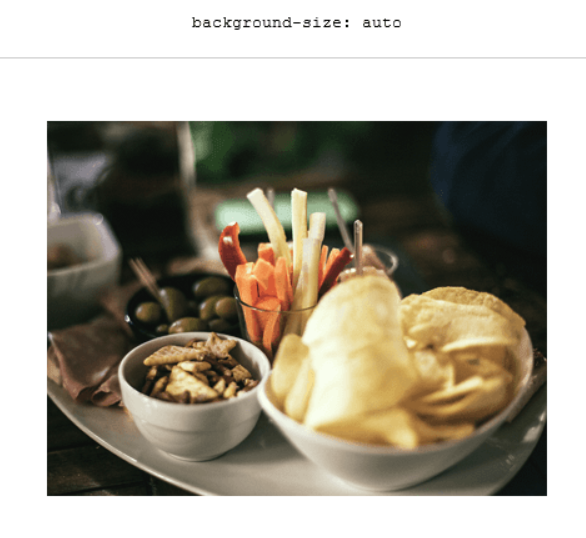
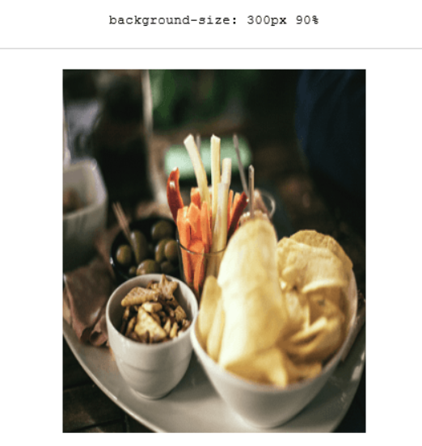
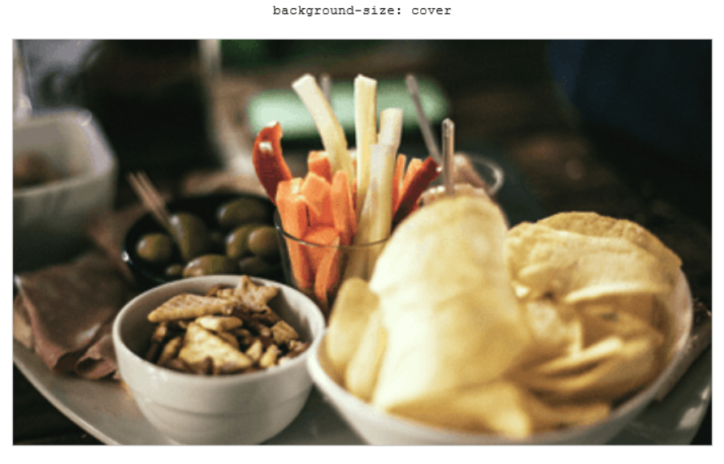
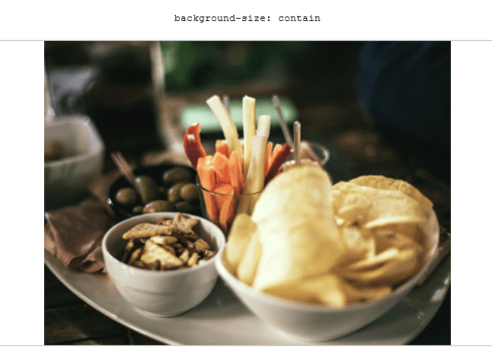

# background-size

배경 이미지의 크기를 설정한다 그대로 두거나, 늘리고 줄이거나, 공간에 맞출 수 있다.

## auto

이미지 크기를 유지합니다. 
기본값

## length

값을 두 개 넣으면 첫 번째 값이 가로 크기, 두 번째 값이 세로 크기입니다. 값을 한 개 넣으면 가로 크기이며,
세로 크기는 원본 이미지의 가로 세로 비율에 맞게 자동으로 정해집니다. 백분율을 사용할 수도 있습니다.

## cover

배경을 사용하는 요소를 다 채울 수 있게 이미지를 확대 또는 축소합니다. 가로 세로 비율을 유지합니다.

## contain

배경을 사용하는 요소를 벗어나지 않는 최대 크기로 이미지를 확대 또는 축소합니다. 가로 세로 비율을 유지합니다.

## 나머진 나도 몰라

initial : 기본값으로 설정합니다. 
inherit : 부모 요소의 속성값을 상속받습니다.

[참고 사이트](https://www.codingfactory.net/10559)
