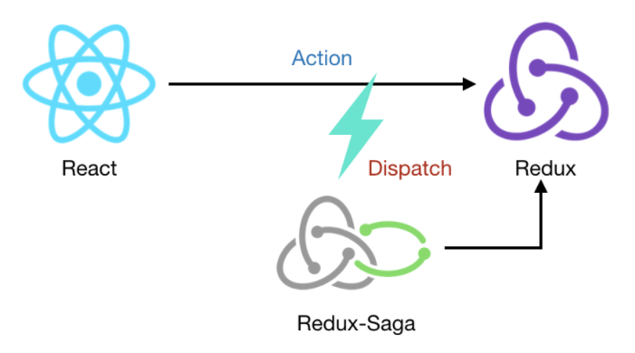

# Redux-saga

redux-saga는 redux의 미들웨어입니다

리덕스가 액션을 수행하면 redux-saga에서 디스패치하여 redux의 액션을 가로챈 뒤, 액션의 역할을 수행 하고 
다시 액션을 발행하여 데이터를 저장하거나 다른 이벤트를 수행시킵니다.

redux-saga와 비슷한 것으론 redux-thunk가 있지만 redux-saga가 더 다양한 작업을 처리 할 수 있기 때문에 redux-saga가 더 좋습니다.

## Redux-saga의 함수들

> <b>all</b> 
> 제너레이터 함수를 배열의 형태로 인자로 넣어주면 병렬로 동시에 실행됩니다. 
> 이때 모든 함수에 대한 결과가 resolve될 때까지 블럭됩니다.

> <b>put</b> 
> 특정 액션의 디스패치하도록 합니다. 
> 결과를 스토어에 디스패치(put) 합니다.

> <b>call, apply</b> 
> 순수 객체만 리턴하는 함수입니다. 오브젝트 메소드 호출을 지원합니다. 
> 첫번째 파라미터는 함수이며 나머지 파라미터는 해당 함수에 넣을 인수 값 입니다. 
> 액션이 발생하면 전달한 함수를 호출하여 실행합니다. 
> API가 리턴될때까지 블럭되며, 비동기 함수 호출 시 용이합니다. 
> call과 apply는 두번째 인자 값의 차이만 있습니다. 

> <b>delay</b> 
> 설정된 시간 이후에 resolve를 하는 Promise 객체를 리턴합니다. 
> 제너레이터를 정지하는데 사용할 수 있습니다. 

> <b>takeEvery</b> 
> 액션이 발생하게되면 task를 실행합니다. 
> task가 종료되기 전에 또 다른 액션이 발생할 경우, 또 하나의 새로운 task를 실행합니다. 

> <b>takeLatest</b> 
> 액션이 발생하게되면 task를 실행합니다. 
> 만약 실행 중인 task가 있다면 기존 task를 종료하고 새로운 task를 실행합니다. 
> 실수로 여러번 클릭했을때를 방지하거나 마지막에 요청된 데이터를 보여줄 때 사용합니다.

> <b>takeLeading</b> 
> 액션이 발생하게되면 task를 실행합니다. 
> 해당 task의 실행이 완료되기 전까지 뒤에 오는 이벤트들을 블럭합니다. 
> 이후 task가 완료되면 액션에 대해 수신합니다.

> <b>throttle</b> 
> 초 이내 요청을 한 번만 보냅니다. 
> 마지막 함수가 호출된 후 일정 시간이 지나기 전 재 호출하지 않습니다. 
> 스크롤 이벤트 사용 시 용이합니다.

> <b>debounce</b> 
> 초 이내 요청을 한 번만 보냅니다. 
> 처음 함수나 마지막 함수만 호출 후 일정시간이 지나기 전 재 호출하지 않습니다.

[참고 자료](https://okayoon.tistory.com/entry/Redux-saga)
