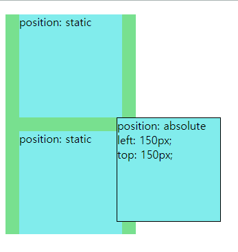

# absolute

html 태그를 기준으로 left, right, top, bottom 값에 따라 움직임
또 absolute를 주면 더 이상 누군가의 자식이 아니게 된다
그래서 상위 태그인 초록색 박스의 크기가 줄어든 걸 볼 수 있다



```html
<div style="background: #78e08f; width: 190px;">
  <div
    style="background: #81ecec; width: 150px; height: 150px; margin: 20px; color: black;"
  >
    position: static
  </div>

  <div
    style="background: #81ecec; width: 150px; height: 150px; margin: 20px; color: black; position: absolute; top: 150px; left: 150px; border: 1px solid black;"
  >
    position: absolute left: 150px;<br />
    top: 150px;
  </div>

  <div
    style="background: #81ecec; width: 150px; height: 150px; margin: 20px; color: black;"
  >
    position: static
  </div>
</div>
```
