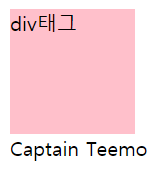
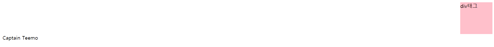
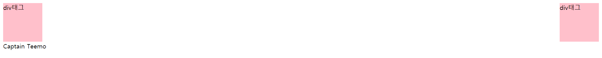

# clear

속성|설명
--|--
none|기본값
left|왼쪽으로 붙는 float 정렬을 취소 한다.
right|오른쪽으로 붙는 float 정렬을 취소 한다.
both|왼쪽, 오른쪽 모두 붙는 float 정렬을 취소한다.

## left



```html
<div style="width: 100px; height: 100px; background-color: pink; float: left;">div태그</div>
<p style="clear: left;">Captain Teemo</p>
```

## right



```html
<div style="width: 100px; height: 100px; background-color: pink; float: right;">div태그</div>
<p style="clear: right;">Captain Teemo</p>
```

## both



```html
<div style="width: 100px; height: 100px; background-color: pink; float: left;">div태그</div>
<div style="width: 100px; height: 100px; background-color: pink; float: right;">div태그</div>
<p style="clear: both;">Captain Teemo</p>
```