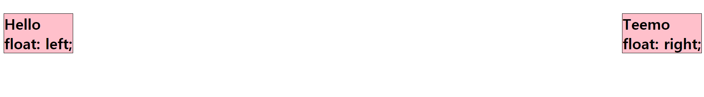

# float

`float`라는 단어는 원래 '뜨다' 라는 의미이며, 원래 웹페이지에서 이미지를 어떻게 띄워서 텍스트와 함께 배치할 것인가에 대한 속성이다

속성값|의미
--|--
none|기본값, 원래 상태
left|자신을 포함하고 있는 박스의 왼편에 떠 있게 함
right|자신을 포함하고 있는 박스의 오른에 떠 있게 함



```html
<h1 style="background-color: pink; border: 1px solid black; float: left;">
    Hello<br>
    float: left;
</h1>
<h1 style="background-color: pink; border: 1px solid black; float: right;">
    Teemo<br>
    float: right;
</h1>
```