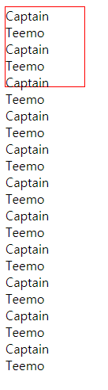
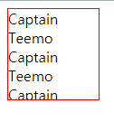
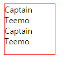
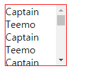
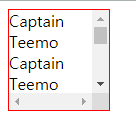

# overflow

컨텐츠가 너무 커서 요소내에 모두 보여주기 힘들때 그것을 어떻게 보여줄지를 지정한다



```html
<!DOCTYPE html>
<html lang="ko">
<head>
    <meta charset="UTF-8">
    <title>test</title>
    <style>
        div {
            border: 1px solid red;
            width: 100px;
            height: 100px;
        }
    </style>
</head>
<body>
    <div>
        Captain Teemo Captain Teemo Captain Teemo Captain Teemo Captain Teemo Captain Teemo Captain Teemo Captain Teemo
        Captain Teemo Captain Teemo Captain Teemo
    </div>
</body>
</html>
```

## visible

overflow의 기본으로 위의 예시와 같다

## hidden

콘텐츠를 안쪽 여백 상자에 맞추기 위해 잘라낸다. 스크롤바를 제공하지 않는다



```css
div {
    border: 1px solid red;
    width: 100px;
    height: 100px;
    overflow: hidden;
}
```


## auto

콘텐츠가 안쪽 여백 상자 안에 들어간다면 `visible`과 동일하게 보이지만, 삐져 나온다면 오른쪽에 스크롤바를 노출함

상자안에 들어갈때|삐져 나올때
--|--
|

```css
div {
    border: 1px solid red;
    width: 100px;
    height: 100px;
    overflow: auto;
}
```

## scroll

`auto`와는 달리 안쪽 여백 상자 안에 들어가도 scroll을 보인다



```css
div {
    border: 1px solid red;
    width: 100px;
    height: 100px;
    overflow: scroll;
}
```