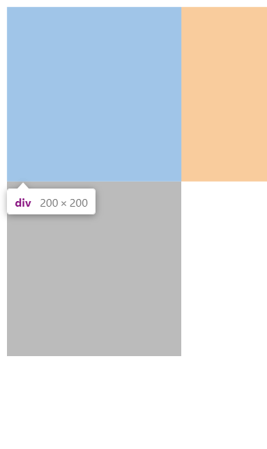

# visibility

## visible
기본값

## hidden
화면에 그려지지는 않지만 해당 요소의 크기 만큼 공간은 차지함
original|select
--|--
|
```html
<div style="width: 200px; height: 200px; visibility: visible; background-color: #aaa;"></div>
<div style="width: 200px; height: 200px; background-color: #bbb;"></div>
```

## collapse
table 요소를 위한 값. width와 padding 값은 유지되나, height 값은 무시됨